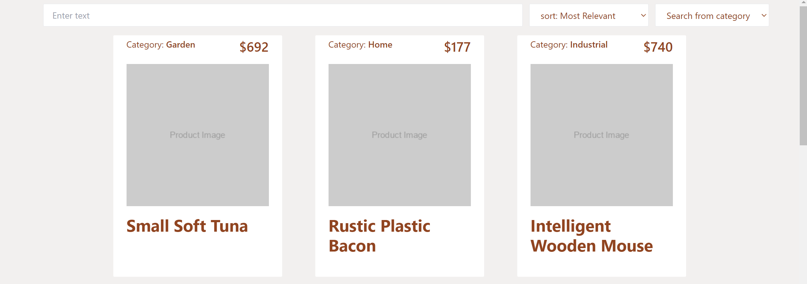
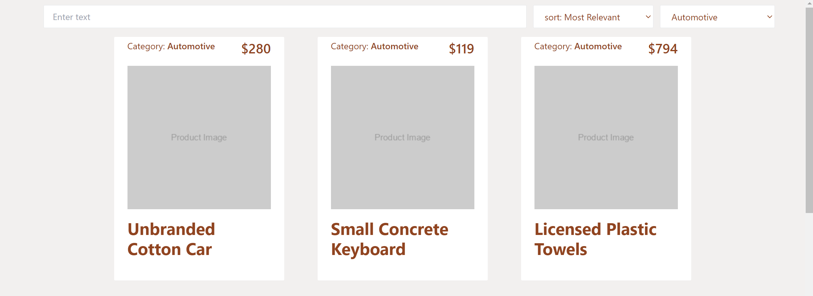
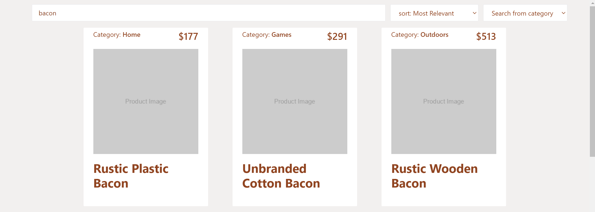
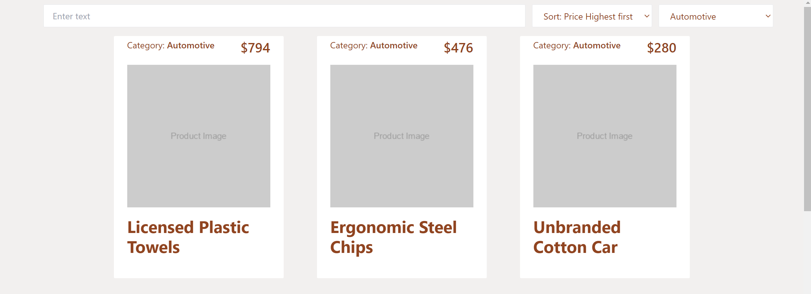

## Product List

This project has been created by a student at Parsity, an online software engineering course. The work in this repository is wholly of the student based on a sample starter project that can be accessed by looking at the repository that this project forks.

If you have any questions about this project or the program in general, visit [parsity.io](https://parsity.io/) or email hello@parsity.io.

# What is it?

A full stack app using Express on the backend and NextJS on the frontend. It simulates an Ecommernce site with a database and online store.

# How to run

```
 npm i
 npm start

 open localhost:8000/generate-fake-data to generate some fake data

 Open a new terminal

 cd frontend
 npm i
 npm run dev

```

## Technologies used

- Nextjs
- Express
- Nodemon
- Faker
- Mongoose
- Tailwindcss

## Features

- Backend

  - Retrieve a list of products with optional sort and filter parameters
  - CRUD operation for both products and review

- Frontend
  - Calls backend for list of products with optional sort and filter parameters
  - Responsive pagination numbers

## File structure

```
- frontend
  - app
    - components
      - Button.jsx
      - PageNumber.jsx
      - PaginationNumbers.jsx
      - PaginationBar.jsx
      - ProductCard.jsx
      - ProductsContainer.jsx
      - SearchAndFilterBar.jsx
    - hooks
      - useProducts.jsx
    - utilities
      - helpers.jsx
    - layout.js
    - page.js
--- Backend files ----
- models
  - product.js
  - review.js
- routes
  - main.js
- utility
  - requestHelpers.js
  - responseHelpers.js
- server.js
```

## component Structure

```
Home
|
| SearchAndFilterBar.jsx
|
| ProductsContainer.jsx
|   |
|   | ProductCard.jsx
|
| PaginationBar.jsx
    |
    | Button.jsx
    |
    | PaginationNumbers.jsx
    |   |
    |   | PageNumber.jsx
    |
    | Button.jsx

```

## Screenshots

Products lists


Filter by category


Filter by search


Sort by price


Pagification


